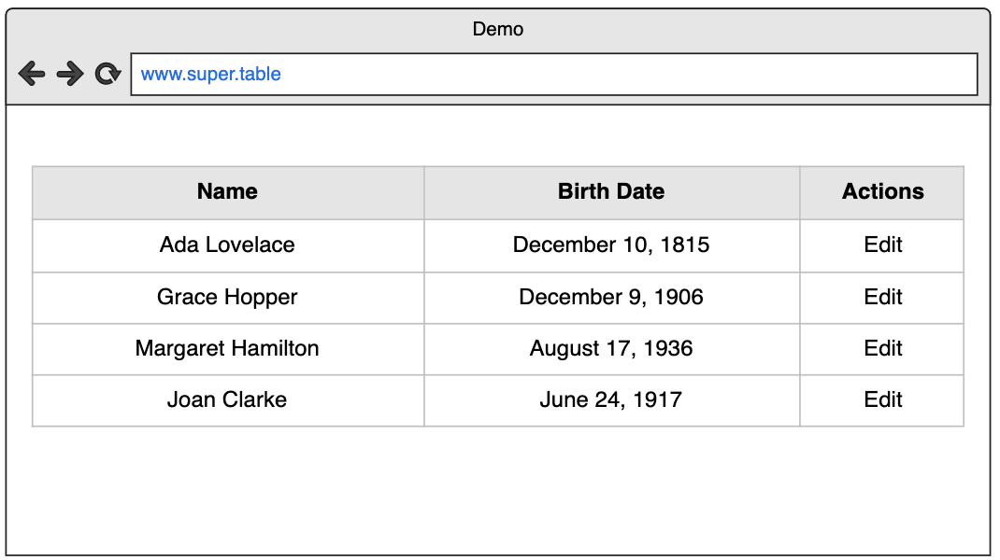
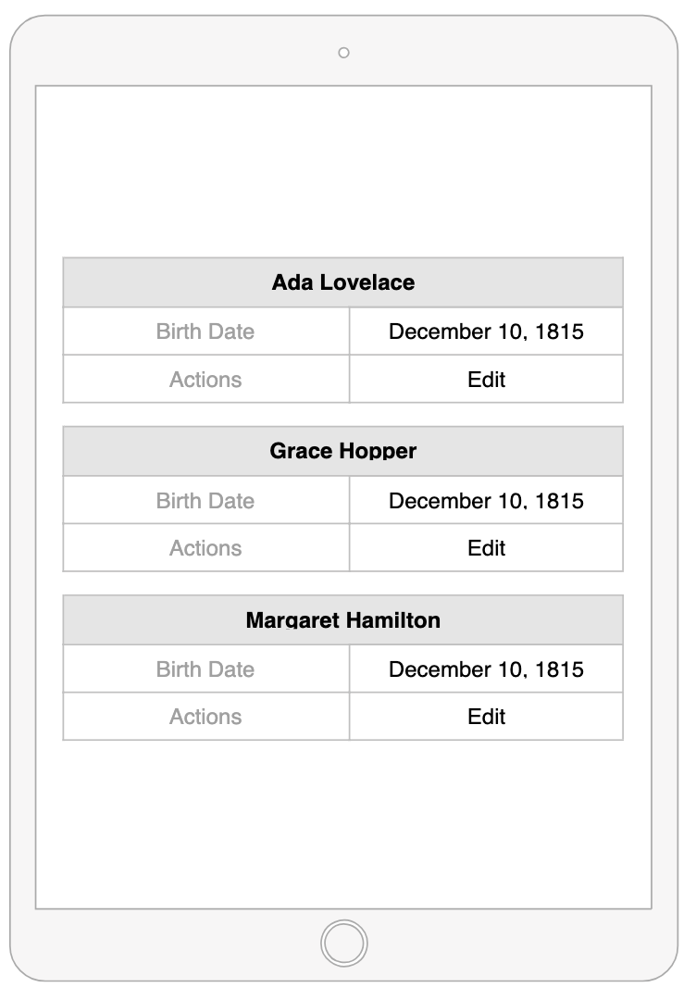

# BigTableChallenge

### Simple responsive table

Create simple responsive table with flexbox and represent the fetched products data 
from the `api` running on `http://localhost:3000/products`

Create angular responsive table component with CSS FlexBox. 
The idea is to differently represent data on different devices. 
On some devices some information could be hidden (it is up to you how you will show them).

Table should have the pagination feature available. 

### Tasks
- [ ] Make sure everything is clear what you need to do
- [ ] Run the project
- [ ] Responsive table design
- [ ] Fetch products from the `api`
- [ ] Pagination (50 items per page)

**Desktop:**



**Mobile:**




## How to start?

You can use a docker containers to set up the local environment.

#### Api 
Run the `npm run server` or the docker command bellow.  
Navigate to `http://localhost:3000/`.

```bash
docker run -d -p 3000:80 -v "$PWD"/server/db.json:/data/db.json clue/json-server
``` 
Api provides a list of 10 000 products on route `http://localhost:3000/products`

You can read more about the `api` [here](https://github.com/typicode/json-server).
 - `http://localhost:3000/products/_limit=10` - will provide only 10 products 
 - `http://localhost:3000/products?_limit=10&_start=10` - will provide next 10 products 
#### Client
Run `ng serve` or the docker command bellow. 
Navigate to `http://localhost:4200/`. 
The app will automatically reload if you change any of the source files.


```bash
 docker run -tiu $(id -u) --rm -v "$PWD":/app -p 4200:4200 trion/ng-cli ng serve
```
